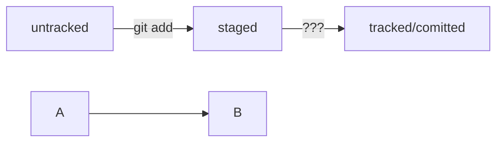

# My first RAEDME.md
## H2 title
### H3 title
**Bold text**
*Italicized text*
> Bloquote text
`code`
---
[hyperlink](https://www.example.com)

## Подсказка: как сделать mermaid-схему
HEAD -- это голова.
Коммит -- это всему голова.
Статусы файлов:
<тут пустая строка!>

```mermaid
%% описание схемы
```
<и тут пустая строка!>

## Вторая схема


